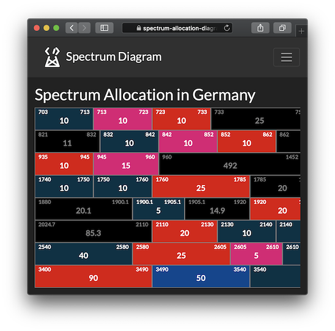
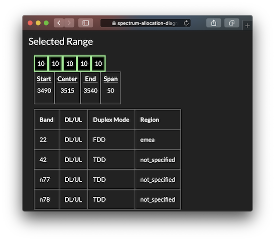
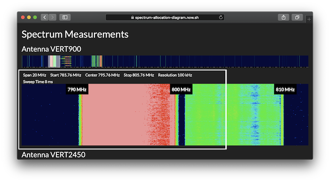

# Interactive Spectrum Allocation Diagram

## Description

This website is an interactive overview of the spectrum allocation in Germany based on the [Bundesnetzagentur document](https://www.bundesnetzagentur.de/SharedDocs/Downloads/EN/Areas/Telecommunications/Companies/TelecomRegulation/FrequencyManagement/ElectronicCommunicationsServices/FrequencyAward2018/20200128_SpectrumDiagram_pdf.pdf?__blob=publicationFile&v=1) and 3GPP TS for [E-UTRA](https://www.3gpp.org/dynareport/36101.htm) and [5G NR](https://www.3gpp.org/DynaReport/38101-1.htm).

Feel free to submit issues and suggestions for improvement in the [corresponding GitHub section](https://github.com/igorskh/react-spectrum-allocation-diagram/issues).



Figure 1 Web application main view



Figure 2 3GPP bands overview for a selected block



Figure 3 Live measurement snapshot

## Build and run

This website is bootstraped with [create-react-app](https://reactjs.org/docs/create-a-new-react-app.html).

In order to run project:
```bash
npm start
```

To create a production build:
```bash
npm build
```
